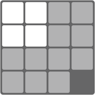
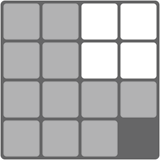
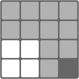
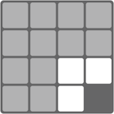
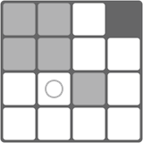

##Summary
Lately I've been watching an iTunes U computer science course; [CS50 from Harvard University][cs50]. Not only is [David J. Malan][david malan] an excellent lecturer, but it's free! Thank you internet. Anyway, as part of the course, one of the exercises set was to solve the [game of fifteen][puzzle15 wikipedia] so I decided to have a crack at writing a solver in javascript.

The result can be found here <http://15puzzle.dalrimple.com>. It's a single page of html, css and javascript. Check out the [github repo][github repo] for fully annotated code.

##Breaking down the problem
For starters I didn't know how to solve the puzzle by hand, let alone by code. So I downloaded a game of fifteen [app][sliderpuzzle app] onto my phone and played it until I worked out a repeatable method for solving the board. The solution I ended up with was to break the board into 4 corners, each with their own method for completion.

###Top Left

The top left region contains all tiles excluding the two right most columns and two bottom most rows. Moving tiles into position in this section of the board is relatively easy. 

1. Identify the next tile to be solved in this region.
2. Map a path between where the tile is, and where the tile belongs. Make sure to avoid any tiles that are already solved.
3. Map a path between where the blank space is and the next step of the path mapped in step 2. Make sure to avoid any tiles that are already solved and the tile you are trying to move.
4. Once the blank space has reached the next step of the tile's path, move the tile one step along it's path.
5. Repeat steps 3 and 4 until the tile has reached it's destination.
6. Go back to step 1 for the next tile to be solved.

###Top Right

The top right region contains all the tile in the two right most columns excluding the bottom 4. Moving tiles into position here is a bit trickier. They have to be moved in pairs otherwise you end up with an incorrect tile stuck in a space where the correct tile should go.

1. Identify the next two tiles that sit at the top of the two columns
2. Whichever is closest, map a path to the position next to where it belongs. Make sure to avoid any tiles that are already solved and the tile you are trying to move
3. Repeat step 2 for the furthest except that it needs to sit underneath the tile that has just been moved.
4. Move the blank space next to the first tile
5. Move the first tile into its destination
6. Move the second tile into its destination
7. Go back to step 1 for the next pair of tiles to be solved.

One thing to watch out for is that if both the tiles to be solved are close to their destinations, it may not be possible to solve them with the steps above. To get around this, move the furthest tile to be at least 2 rows away from it's destination before step 2.

###Bottom Left

The bottom left region is equivalent to the top right; all the tiles in the bottom two rows excluding the four to the right. Similarly tiles need to be moved into position in pairs. It's a little more complex here because the pairs are not consecutive. The first pair would be made up of the first tile in the top row plus the first tile in the the bottom row.

Follow the same steps as for the top right region but instead of moving top down, run the steps left to right.

###Bottom Right

Lastly, the remaining 3 tiles to be solved will be in the four spaces that are left. Funnily enough you can follow exactly the same steps for the top left to solve this region.

##Coding it up
The best way to to understand what I've written is to read through [the code][github repo] but I've written up some of the key strategies below:

###Tracking the tile positions
Every tile in the grid is tracked by its number. Tile 1 has id 1, tile 2 id 2, etc… These ids are stored in an array long enough for every position on the grid. The blank space is denoted by an id of -1.

The x and y position of a grid index is obtained with the simple math below:

	var x = index % gridSize;
	var y = Math.floor(index / gridSize);

###Tracking which tiles are solved
As tiles are being moved around, the ones that have been solved already must be avoided. The solved status is stored in another array the same length as the grid array with a true or false value at each index matching wether the tile is solved or not.

###Path finding

Many of the steps for solving a region described above rely on mapping a path for a tile or the blank space to move along. This is done with a basic path finding algorithm.

This animation shows the position of the blank space, some tiles to avoid marked as grey and the destination for the blank space marked by a circle. The steps for the algorithm are:

1. From the start position, find every valid step forward. I call these terminations as they mark the termination of the paths currently being evaluated.
2. For every termination point, calculate the distance to the destination.
3. Take the closest termination point and find every valid step forward. Remove the old termination point from the pool, and add the newly created ones.
4. Repeat steps 2 and 3 until one of the termination points is the destination point.

###Tying it all together
With pathfinding worked out along with a method for solving each region, the next step was animating the grid being solved and timing everything correctly. This is done by a pretty simple system of callbacks. If you look through [the code][github repo] you'll see pretty much every function has a callback. The basic flow is:

1. Solve first tile of the top left region
2. Call step 1 unless no more tiles are left to be solved
3. Solve first pair of tiles in the top right region
4. Call step 3 unless no more tiles are left to be solved
5. Solve first pair of tiles in the bottom left region
6. Call step 5 unless no more tiles are left to be solved
7. Solve first tile of the bottom right region
8. Call step 7 unless the grid is complete.

##Conclusion
The code isn't particularly useful for any projects I can think of but the challenge was definitely worth it. I learn't quite a bit about structuring callbacks for animation and working out how to implement manual solutions into code.

<!--Link references-->
[cs50]: http://cs50.tv/2011/fall/ "Harvard CS50"
[david malan]: http://cs.harvard.edu/malan/ "David J. Malan"
[puzzle15 wikipedia]: http://en.wikipedia.org/wiki/15_puzzle "Game of 15 Wikipedia Page"
[sliderpuzzle app]: https://itunes.apple.com/au/app/slide.puzzle/id517511112?mt=8 "Slider Puzzle iPhone app"
[github repo]: https://github.com/dalrimple/15puzzle "15 Puzzle Github repo"
[contact]: /contact "Contact Page"